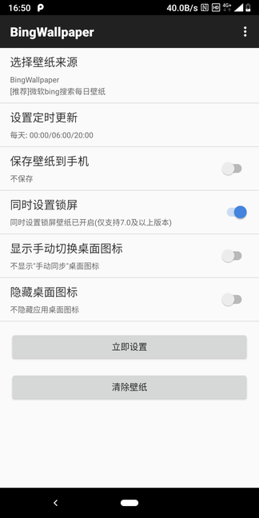
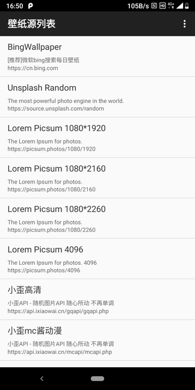
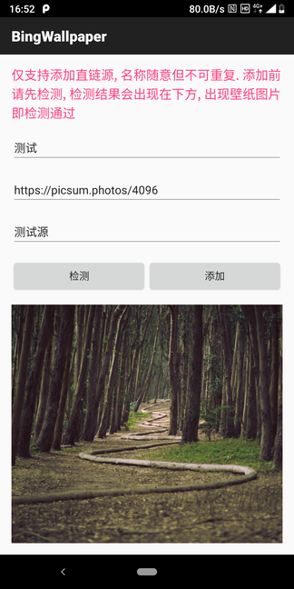
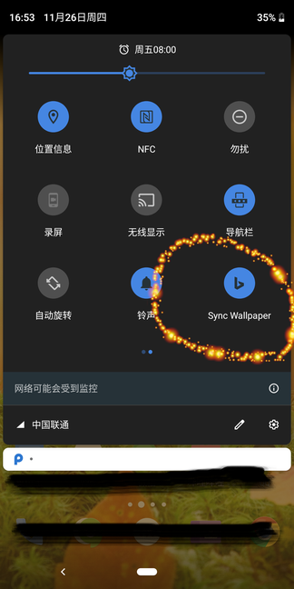

# BingWallpaper

> Android 平台简洁的自动更新壁纸软件, 内置多个壁纸源, 支持添加自定义源。

## 内置壁纸源说明

- [bing 每日壁纸](https://cn.bing.com/)
- [Unsplash Source](https://source.unsplash.com/)
- [Lorem Picsum](https://picsum.photos/)
- [小歪随机壁纸 api](https://api.ixiaowai.cn/)
- [岁月小筑随机背景 api](http://img.xjh.me/)
<!-- - [lorempixel](http://lorempixel.com/) -->

### 壁纸分辨率说明

| 壁纸源 | 分辨率/横竖 | 文件尺寸 | 裁剪 |
| - | - | - | - |
| bing | UHD（4k）/横屏 | 数M | 剧中裁剪|
| Unsplash Source | 手机分辨率 | 几百k | 无需裁剪 |
| picsum | 手机分辨率 | 几百k | 无需裁剪 |
| 小歪随机壁纸 | 不确定 | 几百k | 横屏裁剪/竖屏直接使用 |
| 岁月小筑随机背景 | 不确定 | 几百k | 横屏裁剪/竖屏直接使用 |

## 其它

1. 本软件需要在手机管家中加白名单，避免无法唤醒，导致定时更新功能失效
2. 隐藏桌面图标后， 可以通过以下方式打开主界面：
    - 下拉通知中，有同步壁纸瓷砖(如下图4)，短按瓷砖可同步壁纸，长按瓷砖可进入主界面
    - 拨号盘输入 `*#*#2464#*#*` 入软件界面，(2464 为 T9 键盘 bing 拼音全拼)
3. 问题反馈： 提交 issue

## 更新记录

### 2020.12.18

- bing 壁纸源改用原画裁剪方式，之前固定 1080x1920 已经不适用当今的手机了
- Unsplash Source 和 picsum 两个壁纸源，默认为手机分辨率一致，无需裁剪

### 2020.11.26

2.0 版本发布, 重新设计了整个应用，安装包体积从 1.0 版本几十 k，膨胀到了四十多 k

- 添加了壁纸源功能, 内置了多个壁纸源, 可以手动添加壁纸源
- 定时功能升级, 可以自定义多个时间点
- 添加保存壁纸选项
- 添加设置锁屏壁纸选项
- 添加桌面图标设置功能
- 支持清除壁纸功能, 露出系统原始壁纸
- 更改开源协议为 GPLv3

## TODO

- [ ] 为壁纸源添加桌面快捷方式功能，去除手动同步壁纸图标
- [ ] 排查华为手机壁纸问题
- [ ] 添加 Unsplash 官方 api, 用户输入 access key
- [ ] 支持周期更新
- [ ] 引导用户手机管家加白

## 软件截图

